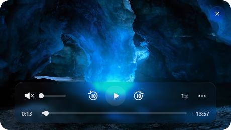
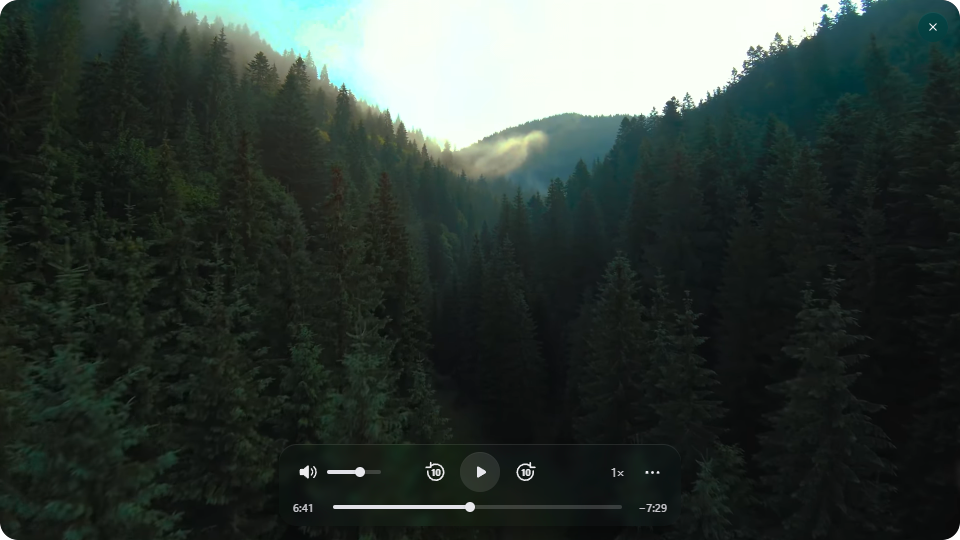
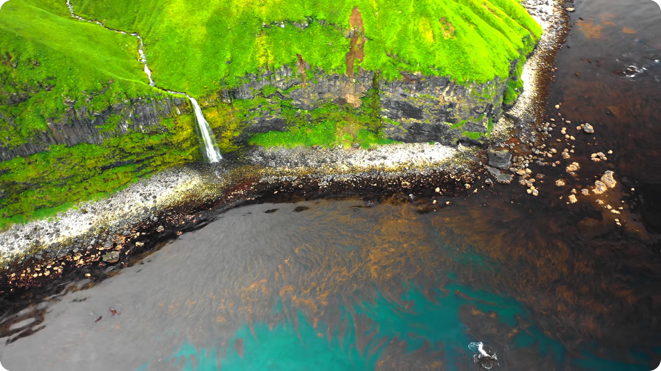

# Moro — YouTube PiP

A floating YouTube player for Windows. Keep a video visible while you work in other apps.

**Free for noncommercial use.** [License terms](LICENSE).

## Install

**Windows 10/11 x64.**

1. Download the **[Windows installer](https://github.com/kwlck/moro/releases/download/v0.1.17/Moro-0.1.17-Setup.exe)**.
2. Open it and click **Install → Finish**. Leave **Launch Moro — YouTube PiP** selected.
3. Paste a YouTube link into the form and press **Enter**.

The installer creates a shortcut. No administrator rights or extra runtime installation is required.

## Controls

**Hold Ctrl while hovering over the video to show and use its controls.**

- **Move the window:** keep Ctrl held and drag an empty area of the video.
- **Click underneath:** release Ctrl. Clicks pass through to the app below the video.
- **Settings:** hold Ctrl and open **…** to change video quality, audio, subtitles, or window appearance.
- **Add another video:** click the Moro system tray icon or reopen the shortcut.
- **Close the video:** use the top-right **×** or **Close video** in the tray menu. Playback stops and the video is unloaded. To exit the app, choose **Quit Moro** in the tray menu.
- **History:** open the link form, then select the clock button to browse recent videos. Select a video to continue watching, or select the trash button to clear the history.

## Screenshots







## Features

- A compact, rounded window that stays above other apps, including fullscreen windows that use the desktop compositor, without taking keyboard focus.
- Translucent playback controls for play/pause, skipping, seeking, volume, and speed.
- Video quality and audio selection when available for the video.
- Subtitles on/off, with your preference saved between videos and launches.
- Smooth resizing and magnetic snapping to screen edges and alignment points.
- Saved volume and mute preferences, restored before sound is enabled.
- Resume playback from the last position when reopening a video.

## Window settings

Adjust size, rounded corners, tint, blur, opacity, and magnetic snapping from the **…** menu. Settings are saved automatically.

**Hover fade** controls how transparent the video becomes when you hover without Ctrl. Holding Ctrl restores the usual opacity and shows the controls.

## Portable version and uninstall

Prefer a portable app? Download the ZIP from [Releases](https://github.com/kwlck/moro/releases/latest), extract the entire folder, and run `Moro.exe`. Click its system tray icon to paste a link.

To remove an installed copy, open Windows **Settings → Apps** and uninstall **Moro — YouTube PiP**.

## Playback and privacy

Games using exclusive fullscreen can bypass desktop overlays. If a game still covers the video, use its borderless fullscreen mode.

Moro uses YouTube's embedded player. Available video qualities and audio tracks depend on the video. Videos that restrict embedding may not play.

Moro has no built-in analytics and requires no API key. Playback connects to YouTube and its media services. Your settings, watch history, and browser/session data are stored locally on your computer. History contains up to 50 videos from the past 30 days and can be cleared from the link form. Completed videos reopen from the beginning. New installations start at 30% volume; later launches use your saved volume and mute preference.

The Windows downloads are unsigned. Moro is an independent app and is not affiliated with YouTube or Apple.

<details>
<summary>Build and development</summary>

## Build from source

Requirements: Windows x64, Node.js 22.12 or newer with npm, and the Windows .NET Framework C# compiler. The build script uses the compiler under `%WINDIR%\Microsoft.NET\Framework64\v4.0.30319\csc.exe`.

```powershell
npm ci
npm test
npm start
```

Package the portable application:

```powershell
npm run package
```

The output is `dist/Moro-win32-x64/`. The native motion helper is compiled from `native/MoroMotion.cs` and unpacked beside Electron's application archive.

To build the installer, install [Inno Setup](https://jrsoftware.org/isdl.php) 6.7 or newer and run:

```powershell
npm run installer
```

The installer is written to `dist/installer/`. With a compiler in another location, first run `npm run package`, then run `tools/build-installer.ps1 -CompilerPath <path-to-ISCC.exe>` from PowerShell.

The checked-in UI is ready to use. After editing `ui/overlay.html`, regenerate its trusted DOM tree with Python 3:

```powershell
npm run build:ui
```

## Verification

```powershell
npm test
npm run smoke
```

The smoke check exercises demo playback, controls, menus, window settings, native hit testing, click-through behavior, and desktop visibility protection. Reports stay in the ignored `outputs/` directory. An optional `--youtube-probe` checks the public sample video from YouTube's [IFrame API documentation](https://developers.google.com/youtube/iframe_api_reference); it requires a network connection and a playable YouTube embed. An optional `--native-drag` check moves the pointer and window on the test machine.

</details>

## License and security

Moro is **free for noncommercial use** under the [PolyForm Noncommercial License 1.0.0](LICENSE). You may use, modify, and redistribute it for purposes permitted by the license. Commercial use and sale for commercial purposes require a separate license from the copyright holder.

Redistributed copies must include the license terms (or their official URL) and the required copyright notice in [NOTICE](NOTICE). Application downloads include these as `MORO-LICENSE.txt` and `MORO-NOTICE.txt`.

Third-party components retain their own licenses; see [THIRD_PARTY_NOTICES.md](THIRD_PARTY_NOTICES.md). See [SECURITY.md](SECURITY.md) for security reporting.
