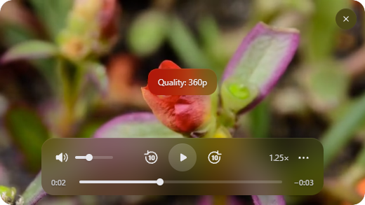

# Moro

A compact floating YouTube player for Windows, with rounded corners, tinted glass controls, a liquid Gooey menu, and magnetic window snapping.



## Download

Get the Windows x64 portable ZIP from [Releases](https://github.com/kwlck/moro/releases/latest). Extract the **entire folder** and run `Moro.exe`. Keep its supporting files beside it. Moro starts in the system tray.

## Use

1. Click the Moro tray icon, paste a YouTube video link, and press Enter. You can also try the included demo.
2. Hold **Ctrl** while the pointer is over the video to reveal controls and interact with it. Drag any free video area while holding Ctrl to move the window.
3. Release Ctrl to pass clicks through to the application underneath. Ordinary hover fades the video without revealing controls.
4. Open **…** for the Gooey menu: link entry, video quality/audio, and window appearance.
5. Adjust **Hover fade** in Window settings. `0%` keeps the usual opacity; `90%` makes the video nearly transparent on ordinary hover. Holding Ctrl restores the usual opacity.
6. Use the top-right close button or tray menu to hide the video. Quit Moro from the tray to exit the application.

The size slider changes the video smoothly while you drag. Its panel stays fixed under the pointer during resizing.

Window settings also include tint, blur, size, corner radius, opacity, snapping distance, animation speed, bounce, and Gooey strength. Settings are saved locally.

## Build from source

Requirements: Windows x64, Node.js 22.12 or newer with npm, and the Windows .NET Framework C# compiler. The build script uses the compiler under `%WINDIR%\Microsoft.NET\Framework64\v4.0.30319\csc.exe`.

```powershell
npm ci
npm test
npm start
```

Package the portable application:

```powershell
npm run package
```

The output is `dist/Moro-win32-x64/`. The native motion helper is compiled from `native/MoroMotion.cs` and unpacked beside Electron's application archive.

The checked-in UI is ready to use. After editing `ui/overlay.html`, regenerate its trusted DOM tree with Python 3:

```powershell
npm run build:ui
```

## Verification

```powershell
npm test
npm run smoke
```

The smoke check exercises demo playback, controls, menus, window settings, native hit testing, click-through behavior, and desktop visibility protection. Reports stay in the ignored `outputs/` directory. An optional `--youtube-probe` checks the public sample video from YouTube's [IFrame API documentation](https://developers.google.com/youtube/iframe_api_reference); it requires a network connection and a playable YouTube embed. An optional `--native-drag` check moves the pointer and window on the test machine.

## Playback and platform limits

Moro loads YouTube embeds and provides custom controls. Available qualities and audio tracks are supplied by YouTube. Restricted or embedding-disabled videos may not play, and changes to YouTube's player internals may affect quality/audio switching. This is an independent application; it is not affiliated with Apple or YouTube.

The application uses native Windows dragging and a compositor-paced motion helper. It stays above ordinary desktop windows and restores system hiding/minimization while the video is intentionally visible. Exclusive fullscreen applications, the Windows secure desktop, and other special system surfaces can still cover it.

The portable release is unsigned.

## Privacy and security

No API key or developer credential is required. Moro does not include an analytics service. Playback connects to YouTube and its media services. Settings and Electron's browser/session data are kept in the current Windows user's local app-data directories; they are not part of the repository or release.

Remote pages run with `nodeIntegration: false`, context isolation, and sandboxing. IPC handlers validate the calling frame and action values. The trusted UI overlay is constructed as DOM nodes, without inserting HTML strings into the remote page.

Source publication excludes developer reports, browser data, personal links, local credentials, and development screenshots. See [THIRD_PARTY_NOTICES.md](THIRD_PARTY_NOTICES.md) for icon and demo-media licenses. Project code is currently **UNLICENSED**; no general reuse license has been granted.
